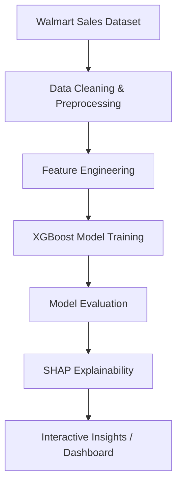

# 🛍️ RetailGPT: AI-Powered Holiday-Aware Sales & Insights Assistant

> **RetailGPT** is an AI-driven sales prediction and analytics tool designed for retail businesses. It predicts **weekly Walmart store sales**, explains factors influencing sales using **SHAP**, and provides actionable insights into the effects of **holidays, CPI, fuel prices, and unemployment**.

---

## 🚀 Features

### 🔹 **Sales Forecasting**

* Uses **XGBoost** to predict weekly store-level sales
* Considers multiple factors: **holidays, temperature, fuel prices, CPI, unemployment**

### 🔹 **Explainable AI (XAI)**

* Uses **SHAP** to explain why sales rise or fall
* Exports results into `shap_explanations.csv`
* Visual insights on feature importance

### 🔹 **Interactive Insights** *(Optional)*

* Predict future sales for specific weeks and stores
* Visualize CPI, holiday impacts, and unemployment trends
* Can be integrated with **Streamlit** for a dashboard UI

---

## 📂 Project Structure

```
RETAIL_GPT-MAIN/
│── Data/
│   ├── Walmart_Sales.csv        # Walmart weekly sales dataset
│
│── Final.py                     # Main Python script (model + insights)
│── xgboost_model.pkl            # Trained XGBoost model
│── shap_explanations.csv        # SHAP feature importance results
│── trail.ipynb                  # Jupyter notebook for experiments
│── retailgpt_response.txt       # Logs or stored chatbot responses
│── .env                         # API keys & sensitive configs
```

---

## ⚡ Tech Stack

| Component                      | Technology Used              |
| ------------------------------ | ---------------------------- |
| **ML Model**                   | XGBoost                      |
| **Explainability**             | SHAP                         |
| **Visualization**              | Matplotlib, Seaborn, Plotly  |
| **Frontend (Optional)**        | Streamlit                    |
| **Backend (Optional)**         | Flask / FastAPI              |
| **LLM Integration (Optional)** | LangChain + OpenAI/Groq      |
| **Dataset**                    | Walmart Weekly Sales Dataset |

---

## 🧠 Model Workflow



---

## 🛠️ Setup Instructions

### **1. Clone the Repository**

```bash
git clone https://github.com/Brejesh-5784/Retail_GPT.git
cd RetailGPT
```

### **2. Create Virtual Environment**

```bash
python -m venv venv
source venv/bin/activate   # Mac/Linux
venv\Scripts\activate      # Windows
```

### **3. Install Dependencies**

```bash
pip install -r requirements.txt
```

### **4. Run the Project**

```bash
python Final.py
```

If using a Streamlit dashboard:

```bash
streamlit run Final.py
```

---

## 💡 Example Use Cases

| Query                                             | What It Does              |
| ------------------------------------------------- | ------------------------- |
| “Predict Store 12 sales for Christmas 2012.”      | Uses XGBoost to forecast  |
| “Why were Store 5’s sales low last Thanksgiving?” | Explains with SHAP        |
| “Show CPI vs Weekly Sales trend.”                 | Plots CPI impact          |
| “How will unemployment affect Store 7 next year?” | Uses predictive analytics |


